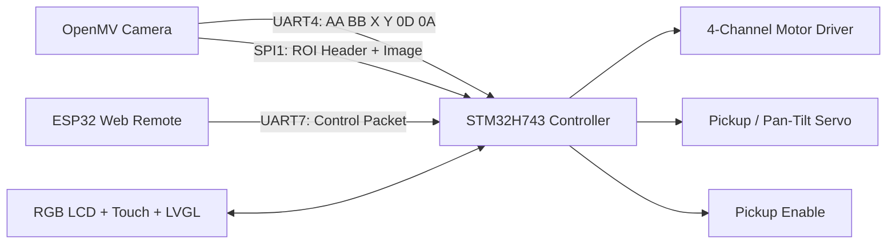
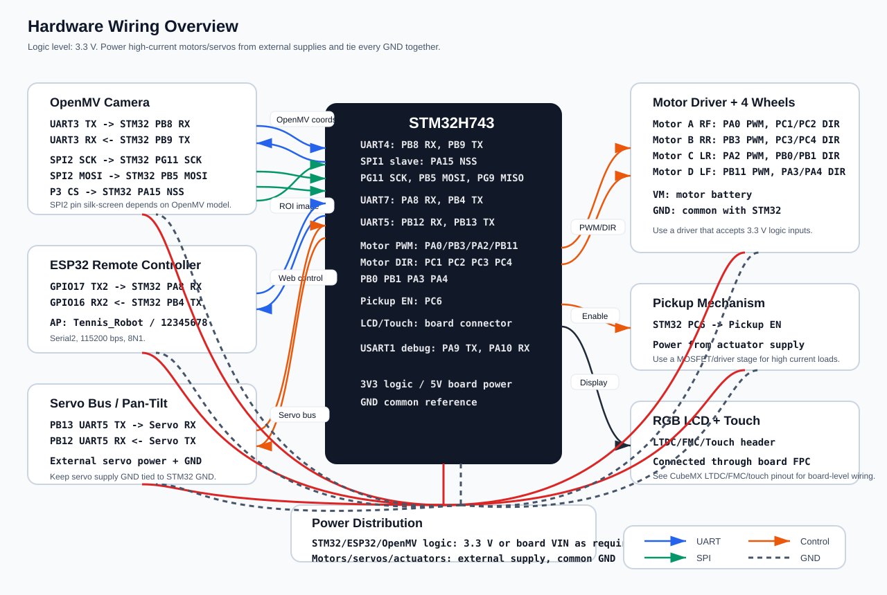

# OpenMV STM32 Tennis Pickup Robot

<p align="center">
  <a href="README.md">中文</a> | <a href="README.en.md">English</a>
</p>

<p align="center">
  <strong>An intelligent tennis pickup robot based on OpenMV, STM32H743, and ESP32</strong>
</p>

<p align="center">
  
  
  
  
  
</p>

This project implements a mobile robot that detects, tracks, and collects tennis balls. OpenMV handles color-based vision detection and outputs target coordinates plus ROI images. STM32H743 manages motion control, servo and motor drivers, the LVGL touch UI, and FreeRTOS task scheduling. ESP32 provides a Wi-Fi access point and a WebSocket remote-control page.

## Demo

<video src="assets/demo.mp4" controls width="100%"></video>

[Watch demo video](assets/demo.mp4)

## Highlights

- OpenMV vision: detects tennis balls using LAB color thresholds and outputs center coordinates, target windows, and 80x80 ROI images.
- STM32 closed-loop control: receives target coordinates over UART and uses PID/filtering logic for alignment, approach, search, and pickup.
- SPI image link: OpenMV sends ROI image data to STM32 over SPI; the STM32 side uses double buffering and timeout recovery.
- ESP32 remote control: ESP32 creates the `Tennis_Robot` access point, with a browser UI for manual movement and automatic pickup mode switching.
- Touchscreen UI: STM32 integrates LVGL, RGB LCD, touch input, and runtime status display.
- Engineering-ready layout: includes an STM32CubeMX/CMake project, a single-file OpenMV script, and a PlatformIO ESP32 project.

## Architecture



## Repository Layout

```text
.
├── Core/                         # STM32CubeMX core startup and peripheral initialization
├── Drivers/
│   ├── User/                     # Robot logic, driver adapters, and LVGL UI
│   │   ├── Inc/
│   │   ├── Src/
│   │   │   ├── car_ball_pid.c    # Tennis tracking, search, approach, and pickup control
│   │   │   ├── carcontrol.c      # Left/right wheel and four-wheel motion wrappers
│   │   │   ├── esp32_link.c      # ESP32 command parser
│   │   │   ├── openmv_uart.c     # OpenMV coordinate UART parser
│   │   │   ├── openmv_spi.c      # OpenMV ROI image SPI receiver
│   │   │   └── servo_uart5.c     # Servo control
│   │   └── ui/                   # LVGL/EEZ exported UI files
│   ├── STM32H7xx_HAL_Driver/
│   ├── CMSIS/
│   └── LVGL/
├── Middlewares/                  # FreeRTOS and other middleware
├── cmake/                        # STM32 CMake toolchain and CubeMX CMake configuration
├── esp32/esp32/                  # ESP32 PlatformIO remote-control project
├── open_mv.py                    # OpenMV vision and UART/SPI output script
├── STM32H743.ioc                 # STM32CubeMX project configuration
├── CMakeLists.txt
└── README.md
```

## Hardware

| Module | Role |
| --- | --- |
| STM32H743 | Main controller, task scheduling, motors, servos, display, and communication |
| OpenMV | Tennis-ball color detection, coordinate output, and ROI image cropping |
| ESP32 | Wi-Fi AP, web page, and WebSocket remote control |
| RGB LCD + touch panel | Local status display and control UI |
| Motor driver + four-wheel chassis | Forward/backward movement, turning, and in-place search |
| Pickup mechanism + servos | Tennis-ball pickup actions and mechanism control |

## Hardware Wiring



The diagram follows the pin assignments in `STM32H743.ioc`, `open_mv.py`, and `esp32/esp32/src/main.cpp`. Keep all logic signals at 3.3 V and connect every module to the same ground reference.

| Link | STM32H743 side | External module side | Notes |
| --- | --- | --- | --- |
| OpenMV target UART | `PB8/UART4_RX`, `PB9/UART4_TX` | `UART3_TX`, `UART3_RX` | `115200 8N1`; coordinate frame `AA BB X Y 0D 0A` |
| OpenMV ROI SPI | `PA15/SPI1_NSS`, `PG11/SPI1_SCK`, `PB5/SPI1_MOSI`, `PG9/SPI1_MISO` | `P3/CS`, `SPI2_SCK`, `SPI2_MOSI`, `SPI2_MISO` | STM32 is SPI slave; OpenMV is SPI master, mode 3 |
| ESP32 remote | `PA8/UART7_RX`, `PB4/UART7_TX` | `GPIO17/TX2`, `GPIO16/RX2` | `115200 8N1`; WebSocket command bridge |
| Servo bus | `PB13/UART5_TX`, `PB12/UART5_RX` | Servo RX/TX | Use an external servo supply and common GND |
| Motor A / RF | `PA0/TIM2_CH1`, `PC1/AIN1`, `PC2/AIN2` | Motor driver PWM/DIR A | Right-front wheel |
| Motor B / RR | `PB3/TIM2_CH2`, `PC3/BIN1`, `PC4/BIN2` | Motor driver PWM/DIR B | Right-rear wheel |
| Motor C / LR | `PA2/TIM2_CH3`, `PB0/CIN1`, `PB1/CIN2` | Motor driver PWM/DIR C | Left-rear wheel |
| Motor D / LF | `PB11/TIM2_CH4`, `PA3/DIN1`, `PA4/DIN2` | Motor driver PWM/DIR D | Left-front wheel |
| Pickup enable | `PC6/PICKUP_EN` | Pickup driver EN | Drive high-current loads through a MOSFET/driver |
| LCD + touch | LTDC/FMC/touch connector | RGB LCD/touch panel | Board-level FPC/header wiring |

## Communication Protocols

### OpenMV UART Coordinate Frame

OpenMV sends little-endian coordinate frames over UART3. STM32 parses them with UART4 + DMA:

```text
AA BB XX XX YY YY 0D 0A
```

| Field | Size | Description |
| --- | --- | --- |
| `AA BB` | 2 bytes | Header |
| `XX XX` | int16 little-endian | Tennis-ball center X coordinate, `-1` when no target is detected |
| `YY YY` | int16 little-endian | Tennis-ball center Y coordinate, `-1` when no target is detected |
| `0D 0A` | 2 bytes | Tail |

### OpenMV SPI ROI Image Frame

```text
DE AD BE EF | ROI_X | ROI_Y | RGB565 image bytes
```

The STM32 side receives frames through double-buffered DMA and handles alignment, bit-shift detection, metadata parsing, and timeout recovery in `openmv_spi.c`.

### ESP32 WebSocket Control

ESP32 creates this access point by default:

```text
SSID: Tennis_Robot
Password: 12345678
```

After connecting to the ESP32, open its web page in a browser to switch between manual and pickup modes and send direction commands. STM32 parses these packets in `esp32_link.c` and converts them into vehicle actions.

## Quick Start

### 1. Flash OpenMV

1. Open `open_mv.py` in OpenMV IDE.
2. Tune the `thresholds` LAB range according to the actual lighting conditions.
3. Save the script to the OpenMV onboard file system. It can usually be named `main.py` for startup execution.

### 2. Build STM32 Firmware

Open `STM32H743.ioc` with STM32CubeIDE, or build with CMake:

```bash
cmake --preset Debug
cmake --build --preset Debug
```

If you use your own GCC Arm toolchain, confirm that `cmake/gcc-arm-none-eabi.cmake` matches your local environment.

### 3. Flash ESP32 Remote Controller

```bash
cd esp32/esp32
pio run
pio run --target upload
pio device monitor
```

After flashing, connect to the `Tennis_Robot` access point and open the ESP32 address in your browser to enter the remote-control page.

## Key Source Files

| File | Description |
| --- | --- |
| `open_mv.py` | Single-file OpenMV vision task that detects tennis balls and outputs data over UART/SPI |
| `Drivers/User/Src/car_ball_pid.c` | Automatic ball search, alignment, approach, pickup hold, and lost-target search |
| `Drivers/User/Src/openmv_uart.c` | UART DMA ring buffer and coordinate-frame state machine parser |
| `Drivers/User/Src/openmv_spi.c` | SPI image-frame DMA receiver, double buffering, and metadata parser |
| `Drivers/User/Src/carcontrol.c` | Left/right wheel and four-wheel motor action wrappers |
| `Drivers/User/Src/esp32_link.c` | ESP32 remote-command receive and mode switching |
| `esp32/esp32/src/main.cpp` | ESP32 AP, web page, WebSocket service, and serial packet output |

## Tuning

- Color threshold: adjust the LAB range in `thresholds` inside `open_mv.py`.
- Tracking speed: tune `CAR_TRACK_SPEED_KP/KI/KD`, max PWM, and deadband in `car_ball_pid.c`.
- Search strategy: tune `CAR_TRACK_SEARCH_ROTATE_DELAY_MS` and `CAR_TRACK_SEARCH_ROTATE_PWM`.
- Pickup trigger: tune `CAR_TRACK_PICKUP_TARGET_Y`, `CAR_TRACK_CLOSE_PICKUP_Y`, and hold duration.
- Serial baud rate: OpenMV, STM32, and ESP32 use `115200` by default.

## Troubleshooting

| Problem | Check |
| --- | --- |
| OpenMV cannot detect the tennis ball | Check lighting, white balance, LAB thresholds, and ball area thresholds |
| STM32 cannot receive coordinates | Check UART pins, baud rate, DMA startup, and frame header/tail consistency |
| SPI image is unstable | Check CS timing, SPI mode, wire length, cache invalidation, and timeout restart logic |
| Robot jitters or overshoots the target | Lower PID gains, max PWM, or increase the steering deadband |
| ESP32 page does not open | Confirm that you are connected to the `Tennis_Robot` AP and check serial monitor output |

## Roadmap

- [ ] Add hardware wiring photos and real-machine images.
- [ ] Add an OpenMV threshold calibration workflow.
- [ ] Add STM32/ESP32 firmware release packages.
- [ ] Add automated build docs or GitHub Actions.

## License

This project is licensed under the [MIT License](LICENSE).
