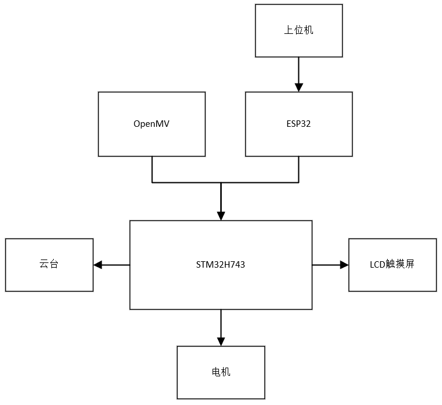
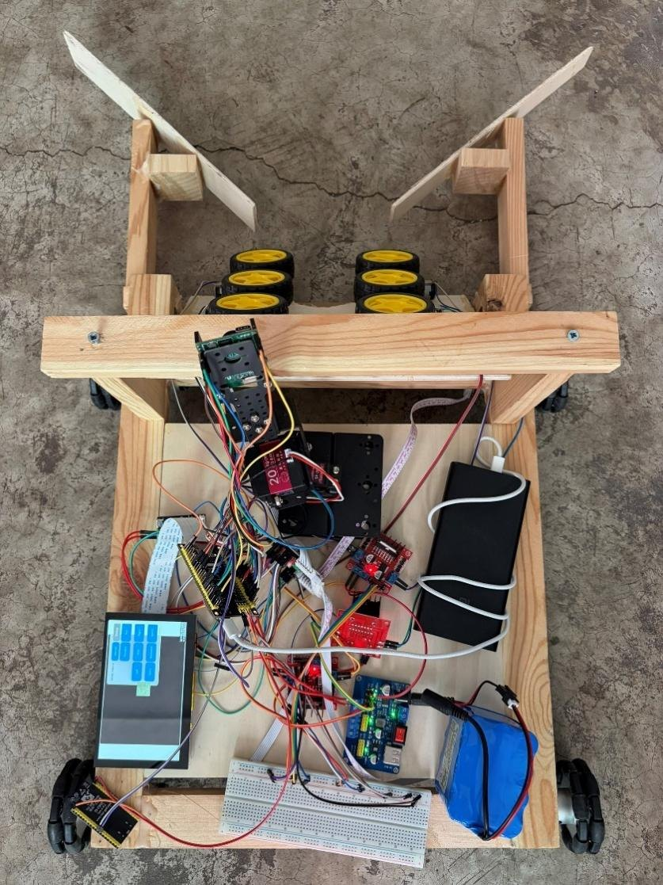
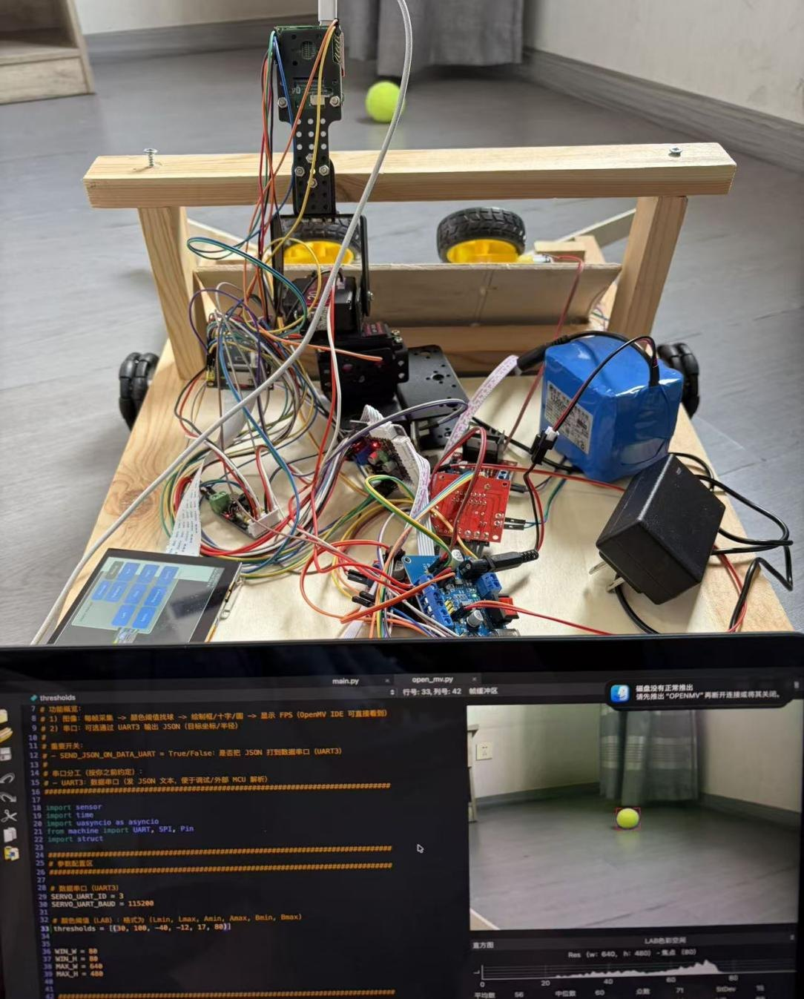
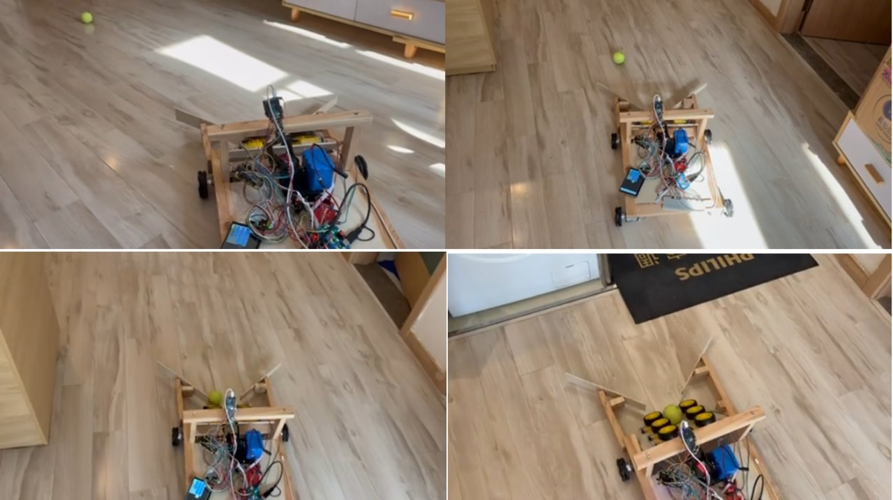
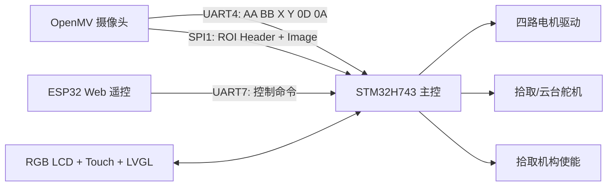

# OpenMV STM32 Tennis Pickup Robot

<p align="center">
  <a href="README.md">中文</a> | <a href="README.en.md">English</a>
</p>

<p align="center">
  <strong>基于 OpenMV + STM32H743 + ESP32 的智能网球捡球机器人</strong>
</p>

<p align="center">
  
  
  
  
  
</p>

这个项目实现了一台可识别、追踪并拾取网球的移动机器人。OpenMV 负责颜色视觉检测并输出目标坐标与局部图像，STM32H743 负责运动控制、舵机/电机驱动、LVGL 触摸屏界面和 FreeRTOS 任务调度，ESP32 提供 Wi-Fi 热点与 WebSocket 遥控页面。

## 项目介绍

本项目面向网球训练场中散落网球重复、耗时的人工回收工作，设计并实现了一套集视觉感知、运动控制、自动拾取和人机交互于一体的移动机器人。系统以 STM32H743 为控制核心，利用 OpenMV 实时获取网球位置，结合底盘与拾取机构完成从目标搜索到回收的完整流程。

机器人的主要工作流程如下：

1. OpenMV 通过 LAB 颜色阈值检测网球，并输出目标中心坐标与 80x80 ROI 图像。
2. STM32H743 根据视觉反馈执行目标搜索、方向对准、速度调节和接近控制。
3. 网球进入拾取范围后，底盘与拾取机构协同工作，将网球卷入收球仓。
4. 用户可通过 800x480 LCD 触摸屏或 ESP32 Web 页面查看状态、手动遥控并切换自动拾取模式。



系统采用感知层、控制层、执行层与交互层协同设计：OpenMV 负责视觉感知，STM32H743 负责多任务调度与闭环控制，电机和舵机负责运动与拾取，ESP32 和触摸屏提供本地及无线交互。

## 演示

<video src="assets/demo.mp4" controls width="100%"></video>

[观看演示视频](assets/demo.mp4)

## 项目亮点

- OpenMV 视觉识别：基于 LAB 颜色阈值查找网球目标，输出中心点、目标窗口和 80x80 ROI 图像。
- STM32 主控闭环：通过 UART 接收目标坐标，使用 PID/滤波逻辑控制小车对准、前进、搜索和拾取。
- SPI 图像链路：OpenMV 通过 SPI 向 STM32 发送 ROI 图像数据，STM32 侧带双缓冲和超时恢复。
- ESP32 遥控：ESP32 建立 `Tennis_Robot` 热点，浏览器页面支持手动方向控制与自动拾取模式切换。
- 触摸屏交互：STM32 集成 LVGL 界面、RGB LCD、触摸输入和运行状态显示。
- 工程化结构：包含 STM32CubeMX/CMake 工程、OpenMV 单文件脚本和 PlatformIO ESP32 工程。

## 实物与测试

以下图片来自项目论文中的系统测试部分，展示了机器人原型、OpenMV 识别测试和自动捡球过程。

| 机器人原型与整体运行状态 | OpenMV 网球检测测试 |
| --- | --- |
|  |  |



测试中，OpenMV 能够实时识别摄像头视野内的网球并回传目标坐标；机器人在约 3 米范围内捕获目标后，可完成搜索、对准、接近和拾取动作。LCD 与 Web 控制端可实时响应模式切换及方向控制指令。

## 系统架构



## 目录结构

```text
.
├── Core/                         # STM32CubeMX 生成的核心启动与外设初始化代码
├── Drivers/
│   ├── User/                     # 机器人业务逻辑、驱动适配、LVGL UI
│   │   ├── Inc/
│   │   ├── Src/
│   │   │   ├── car_ball_pid.c    # 网球追踪、搜索、靠近和拾取控制
│   │   │   ├── carcontrol.c      # 小车左右轮/四轮运动封装
│   │   │   ├── esp32_link.c      # ESP32 指令解析
│   │   │   ├── openmv_uart.c     # OpenMV 坐标串口解析
│   │   │   ├── openmv_spi.c      # OpenMV ROI 图像 SPI 接收
│   │   │   └── servo_uart5.c     # 舵机控制
│   │   └── ui/                   # LVGL/EEZ 导出的 UI 文件
│   ├── STM32H7xx_HAL_Driver/
│   ├── CMSIS/
│   └── LVGL/
├── Middlewares/                  # FreeRTOS 等中间件
├── cmake/                        # STM32 CMake toolchain 与 CubeMX CMake 配置
├── esp32/esp32/                  # ESP32 PlatformIO 遥控工程
├── open_mv.py                    # OpenMV 视觉识别与 UART/SPI 输出脚本
├── STM32H743.ioc                 # STM32CubeMX 工程配置
├── CMakeLists.txt
└── README.md
```

## 硬件组成

| 模块 | 作用 |
| --- | --- |
| STM32H743 | 主控、任务调度、电机/舵机/屏幕/通信管理 |
| OpenMV | 网球颜色识别、坐标输出、ROI 图像裁剪 |
| ESP32 | Wi-Fi AP、Web 页面、WebSocket 遥控 |
| RGB LCD + 触摸屏 | 本地状态显示与控制界面 |
| 电机驱动与四轮底盘 | 前进、后退、转向、原地搜索 |
| 拾取机构与舵机 | 网球拾取动作与机构控制 |

## 硬件接线


示意图依据 `STM32H743.ioc`、`open_mv.py` 和 `esp32/esp32/src/main.cpp` 中的引脚分配绘制。所有逻辑信号保持 3.3 V，并确保所有模块共地。

| 连接 | STM32H743 侧 | 外部模块侧 | 说明 |
| --- | --- | --- | --- |
| OpenMV target UART | `PB8/UART4_RX`, `PB9/UART4_TX` | `UART3_TX`, `UART3_RX` | `115200 8N1`; coordinates frame `AA BB X Y 0D 0A` |
| OpenMV ROI SPI | `PA15/SPI1_NSS`, `PG11/SPI1_SCK`, `PB5/SPI1_MOSI`, `PG9/SPI1_MISO` | `P3/CS`, `SPI2_SCK`, `SPI2_MOSI`, `SPI2_MISO` | STM32 为 SPI 从机；OpenMV 为 SPI 主机，模式 3 |
| ESP32 remote | `PA8/UART7_RX`, `PB4/UART7_TX` | `GPIO17/TX2`, `GPIO16/RX2` | `115200 8N1`; WebSocket 指令桥接 |
| Servo bus | `PB13/UART5_TX`, `PB12/UART5_RX` | 舵机 RX/TX | 使用独立舵机电源并共地 |
| Motor A / RF | `PA0/TIM2_CH1`, `PC1/AIN1`, `PC2/AIN2` | 电机驱动 PWM/DIR A | 右前轮 |
| Motor B / RR | `PB3/TIM2_CH2`, `PC3/BIN1`, `PC4/BIN2` | 电机驱动 PWM/DIR B | 右后轮 |
| Motor C / LR | `PA2/TIM2_CH3`, `PB0/CIN1`, `PB1/CIN2` | 电机驱动 PWM/DIR C | 左后轮 |
| Motor D / LF | `PB11/TIM2_CH4`, `PA3/DIN1`, `PA4/DIN2` | 电机驱动 PWM/DIR D | 左前轮 |
| Pickup enable | `PC6/PICKUP_EN` | 拾取机构驱动 EN | 大电流负载需通过 MOSFET/驱动级控制 |
| LCD + touch | LTDC/FMC/触摸接口 | RGB LCD/触摸屏 | 板级 FPC/排针连接 |

## 通信协议

### OpenMV UART 坐标帧

OpenMV 通过 UART3 发送小端坐标帧，STM32 使用 UART4 + DMA 解析：

```text
AA BB XX XX YY YY 0D 0A
```

| 字段 | 大小 | 说明 |
| --- | --- | --- |
| `AA BB` | 2 bytes | 帧头 |
| `XX XX` | int16 little-endian | 网球中心 X 坐标，未检测到时为 `-1` |
| `YY YY` | int16 little-endian | 网球中心 Y 坐标，未检测到时为 `-1` |
| `0D 0A` | 2 bytes | 帧尾 |

### OpenMV SPI ROI 图像帧

```text
DE AD BE EF | ROI_X | ROI_Y | RGB565 image bytes
```

STM32 侧使用双缓冲 DMA 接收，并在 `openmv_spi.c` 中处理对齐、bit shift 检测、元数据解析与超时重启。

### ESP32 WebSocket 控制

ESP32 默认创建热点：

```text
SSID: Tennis_Robot
Password: 12345678
```

浏览器连接 ESP32 后可以切换手动/拾取模式，并发送方向控制指令。STM32 侧由 `esp32_link.c` 解析并转化为车辆动作。

## 快速开始

### 1. 烧录 OpenMV

1. 使用 OpenMV IDE 打开 `open_mv.py`。
2. 根据实际光照调整 `thresholds` LAB 阈值。
3. 将脚本保存到 OpenMV 板载文件系统，通常可命名为 `main.py` 以便上电自启动。

### 2. 构建 STM32 固件

使用 STM32CubeIDE 打开 `STM32H743.ioc`，或使用 CMake 构建：

```bash
cmake --preset Debug
cmake --build --preset Debug
```

如果你使用自己的 GCC Arm 工具链，请先确认 `cmake/gcc-arm-none-eabi.cmake` 中的路径配置与本机环境一致。

### 3. 烧录 ESP32 遥控端

```bash
cd esp32/esp32
pio run
pio run --target upload
pio device monitor
```

烧录完成后，连接 `Tennis_Robot` 热点，在浏览器打开 ESP32 地址即可进入遥控页面。

## 核心源码

| 文件 | 说明 |
| --- | --- |
| `open_mv.py` | OpenMV 单文件视觉任务，负责检测网球并通过 UART/SPI 输出 |
| `Drivers/User/Src/car_ball_pid.c` | 自动寻球、对准、靠近、拾取保持和丢失目标搜索 |
| `Drivers/User/Src/openmv_uart.c` | UART DMA 环形缓冲与坐标帧状态机解析 |
| `Drivers/User/Src/openmv_spi.c` | SPI 图像帧 DMA 接收、双缓冲、元数据解析 |
| `Drivers/User/Src/carcontrol.c` | 小车左右轮和四轮电机动作封装 |
| `Drivers/User/Src/esp32_link.c` | ESP32 遥控命令接收与模式切换 |
| `esp32/esp32/src/main.cpp` | ESP32 AP、Web 页面、WebSocket 服务和串口下发 |

## 参数调试

- 颜色阈值：在 `open_mv.py` 的 `thresholds` 中调整 LAB 范围。
- 跟踪速度：在 `car_ball_pid.c` 中调整 `CAR_TRACK_SPEED_KP/KI/KD`、最大 PWM 和死区。
- 搜索策略：调整 `CAR_TRACK_SEARCH_ROTATE_DELAY_MS` 与 `CAR_TRACK_SEARCH_ROTATE_PWM`。
- 拾取触发：调整 `CAR_TRACK_PICKUP_TARGET_Y`、`CAR_TRACK_CLOSE_PICKUP_Y` 和保持时间。
- 串口速率：OpenMV、STM32 与 ESP32 默认使用 `115200`。

## 常见问题

| 问题 | 检查项 |
| --- | --- |
| OpenMV 检测不到网球 | 检查光照、白平衡、LAB 阈值和球体面积阈值 |
| STM32 收不到坐标 | 检查 UART 引脚、波特率、DMA 是否启动、帧头帧尾是否一致 |
| SPI 图像不稳定 | 检查 CS 时序、SPI 模式、线长、缓存失效和超时重启逻辑 |
| 小车抖动或冲过目标 | 降低 PID 增益、最大 PWM 或增大转向死区 |
| ESP32 页面打不开 | 确认已连接 `Tennis_Robot` 热点，并查看串口监视器输出 |

## 路线图

- [x] 增加硬件接线图和实物图片。
- [ ] 补充 OpenMV 阈值标定流程。
- [ ] 增加 STM32/ESP32 固件版本发布包。
- [ ] 增加自动化构建说明或 GitHub Actions。

## 开源许可

本项目基于 [MIT License](LICENSE) 开源。
